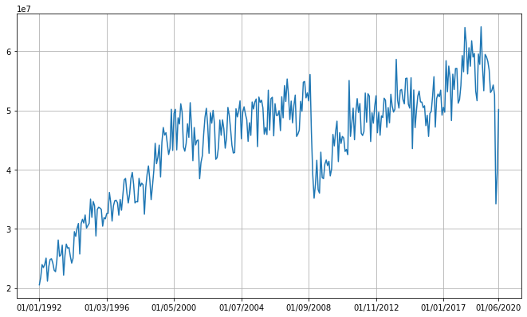
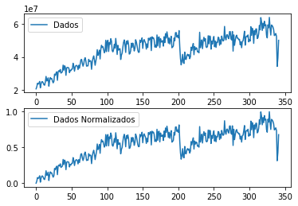
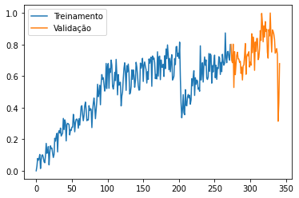
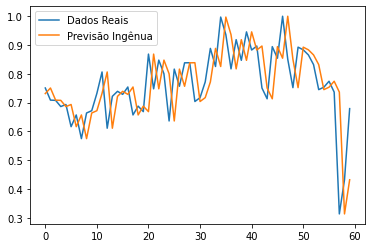
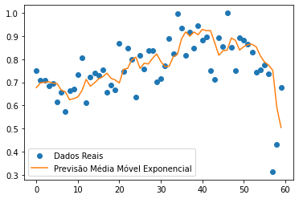
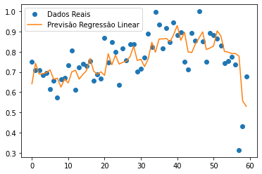
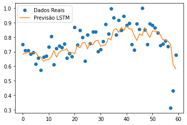
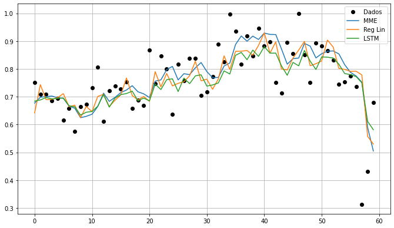

# Aplicação De Machine Learning Na Cadeia De Suprimentos: Utilizando Aprendizagem De Longo Prazo Para Previsão De Demanda

Trabalho de Conclusão de Curso apresentado para obtenção do grau de Bacharel em
Ciência da Computação pela Universidade Regional Integrada do Alto Uruguai e das
Missões.

Avaliado com nota 10 pela banca.

# CONTEÚDO DESTE REPOSITÓRIO

* [Monografia Completa](MONOGRAFIA.pdf)
* [Resumo](#resumo)
* [Abstract](#abstract)
* [Jupyter-Notebook](#jupyter-notebook)
* [Arquivos do ambiente Jupyter-Notebook](jupyter-notebook)

# RESUMO E ABSTRACT

## RESUMO

No mercado conectado em que vivemos, as cadeias de suprimentos possuem um papel
essencial e, para garantir sua produtividade, é muito importante manter um
planejamento constante. Uma informação fundamental para esse planejamento é o
conhecimento da demanda esperada para o curto e médio-prazo. O presente trabalho
apresenta uma abordagem de previsão utilizando Machine Learning para buscar uma
maior acurácia nessas previsões. Foram aplicados sobre o mesmo conjunto de dados
alguns dos métodos mais populares utilizados hoje no meio logístico e o modelo
de Rede Neural construído utilizando a arquitetura de Long Short-Term Memory.
Após aplicados sobre o conjunto de dados, foi medida a acurácia com as métricas
de Erro Médio Absoluto e Raiz do Erro Quadrático Médio. Foram apresentado
gráficos, códigos e resultados dessas previsões, levando a acreditar que a
Regressão Linear Multivariada é o mé- todo que traz resultados mais
satisfatórios na resolução deste problema.

## ABSTRACT

In the connected market we live in, supply chains play an essential role, and to
guarantee their high productivity it’s very important to keep constant planning.
A key information for this planning is the knowledge of demand forecast for the
short and medium term. This work presents a forecasting approach using Machine
Learning to seek greater accuracy in these predictions. Under the same data set,
some purely common methods used today in logistics and the Neural Network model
built using the Long Short-Term Memory architecture were be applied. After being
applied to the dataset, the accuracy of each method was then measured using the
Mean Absolute Error and the Rooted Mean Squared Error. Plots, codes and results
of those predictions where presented, and leading to believe that Multivariate
Linear Regression is the method that brings the most satisfactory results on the
solution to this problem.

# JUPYTER NOTEBOOK

## Entrada dos dados


```python
import pandas as pd
df = pd.read_csv("./datasets/NAICS_number_of_orders_not_seasonally_ajusted.csv")
df.head(3)
```


<div>
<style scoped>
    .dataframe tbody tr th:only-of-type {
        vertical-align: middle;
    }

    .dataframe tbody tr th {
        vertical-align: top;
    }

    .dataframe thead th {
        text-align: right;
    }
</style>
<table border="1" class="dataframe">
  <thead>
    <tr style="text-align: right;">
      <th></th>
      <th>DATA</th>
      <th>DEMANDA</th>
    </tr>
  </thead>
  <tbody>
    <tr>
      <th>0</th>
      <td>01/01/1992</td>
      <td>20532164</td>
    </tr>
    <tr>
      <th>1</th>
      <td>01/02/1992</td>
      <td>21792493</td>
    </tr>
    <tr>
      <th>2</th>
      <td>01/03/1992</td>
      <td>23948450</td>
    </tr>
  </tbody>
</table>
</div>


```python
datas = df['DATA'].values
dados = df.drop(columns=['DATA'])
dados = dados['DEMANDA'].tolist()
```


```python
import matplotlib.pyplot as plt

ticks = []
indice_grafico = []
for i in (range(0, len(datas), 50)):
    indice_grafico.append(datas[i])
    ticks.append(i)
indice_grafico.append(datas[len(datas)-1])
ticks.append(len(datas)-1)

fig, axs = plt.subplots(1, figsize=(11, 5.5))
axs.plot(dados)
axs.set_xticks(ticks)
axs.set_xticklabels(indice_grafico)
axs.yaxis.grid(True)
axs.xaxis.grid(True)
plt.subplots_adjust(left=0.1, right=0.9, top=0.95, bottom=0.05)
plt.rcParams.update({'font.size': 10})
plt.show()
```


    

    


```python
from sklearn.preprocessing import MinMaxScaler
import numpy as np

dados_escalados = np.array(dados).reshape(-1, 1)
escalador = MinMaxScaler(feature_range=(0, 1))
dados_escalados = escalador.fit_transform(dados_escalados)
dados_escalados = dados_escalados.ravel()
print(dados_escalados[0:3])

fig, axs = plt.subplots(2)
axs[0].plot(dados, label='Dados')
axs[0].legend()
axs[1].plot(dados_escalados, label='Dados Normalizados')
axs[1].legend()
plt.show()
```

    [0.         0.02889657 0.07832792]


    

    


```python
percent_treino = 0.8 # ex: 0.8 = linha do 80%
n_linhas = int(percent_treino * len(dados_escalados))

x_treinar = dados_escalados[:n_linhas]
x_validar = dados_escalados[n_linhas:]

indice_grafico_treinar = datas[:n_linhas]
indice_grafico_validar = datas[n_linhas:]

x_treinar_index = range(0, len(x_treinar))
x_validar_index = range(len(x_treinar), len(x_treinar)+len(x_validar))
plt.plot(x_treinar_index, x_treinar, label='Treinamento')
plt.plot(x_validar_index, x_validar, label='Validação')
plt.legend()
plt.show()
```


    

    


```python
def concatenar_tempos_anteriores(t, concat_dados):
    x_concatenado = []
    y_concatenado = []
    diferenca = len(concat_dados)%t
    for i in range(t+diferenca, len(concat_dados)):
        x_concatenado.append(concat_dados[i-t:i])
        y_concatenado.append(concat_dados[i])
    return x_concatenado, y_concatenado
```


```python
tempos_anteriores = 6

x_treinar_concat, y_treinar_concat = concatenar_tempos_anteriores(tempos_anteriores, x_treinar)
x_validar_concat, y_validar_concat = concatenar_tempos_anteriores(tempos_anteriores, x_validar)

indice_grafico_treinar = indice_grafico_treinar[tempos_anteriores-1:]
indice_grafico_validar = indice_grafico_validar[tempos_anteriores-1:]
```

## Previsão Ingênua


```python
previsao_ingenua = dados_escalados[:-1]
indice_previsoes_classicas = (len(y_validar_concat))*-1
previsao_ingenua = previsao_ingenua[indice_previsoes_classicas:]

plt.plot(y_validar_concat, label='Dados Reais')
plt.plot(previsao_ingenua, label='Previsão Ingênua')
plt.legend()
plt.show()
```


    

    


## Média Móvel Exponencial


```python
def media_movel_exponencial(x, S_inicial, alpha, beta):
    S = S_inicial # Media simples do periodo anterior deve ser o inicial de S
    T = 0 # Tendência para primeira previsão é 0
    y = []

    for i in range (1, len(x)+1):
        A = x[i-1] # Valor real do tempo anterior
        S_anterior = S
        
        S = (alpha * A) + ((1 - alpha) * (S_anterior + T))
        S = round(S, 4)

        T = beta * (S - S_anterior) + (1 - beta) * T
        T = round(T, 4)
        
        F = S + T
        F = round(F, 4)
        
        y.append(F)
    
    return y
```


```python
# Envia ultimo registro do periodo anterior mais todos a serem previstos
x_media_movel = dados_escalados[12:-1]
# Média do primeiro ano
s_inicial = np.average(dados_escalados[:12])
previsao_mme = media_movel_exponencial(x_media_movel, s_inicial, 0.3, 0.15)
previsao_mme = previsao_mme[indice_previsoes_classicas:]

plt.plot(y_validar_concat, 'o', label='Dados Reais')
plt.plot(previsao_mme, label='Previsão Média Móvel Exponencial')
plt.legend()
plt.show()
```


    

    


## Regressão Linear


```python
from sklearn.linear_model import LinearRegression
modelo_regressao = LinearRegression()
modelo_regressao.fit(x_treinar_concat, y_treinar_concat)
previsao_reg_lin = modelo_regressao.predict(x_validar_concat)

plt.plot(y_validar_concat, 'o', label='Dados Reais')
plt.plot(previsao_reg_lin, label='Previsão Regressão Linear')
plt.legend()
plt.show()
```


    

    


## LSTM


```python
import tensorflow as tf
tf.compat.v1.disable_eager_execution()
# Define semente aleatória para poder replicar resutlados
#np.random.seed(1234)
#tf.random.set_seed(1234)
# Transforma em 3d
np3d_x_treinar_concat = np.array(x_treinar_concat)
n_aspectos = np3d_x_treinar_concat.shape[1]
np3d_x_treinar_concat = np.reshape(x_treinar_concat,
                                   newshape=(-1, n_aspectos, 1))

np_y_treinar_concat = np.array(y_treinar_concat)
```


```python
from tensorflow.keras.models import load_model
modelo = load_model('./modelos/lstm_multi.h5')
```

As duas células abaixo estão comentadas porque já estamos carregando o modelo na de cima.
Para gerar um novo, a de cima seria substituída por ambas abaixo

```python
from tensorflow.keras.models import Sequential
from tensorflow.keras.layers import LSTM, Dense
from tensorflow.keras import regularizers, callbacks, optimizers

# Cria o modelo
modelo = Sequential()
modelo.add(LSTM(units=16,
                input_shape=(n_aspectos, 1),
                activation="selu",
                kernel_initializer="lecun_normal",
                kernel_regularizer=regularizers.l2(0.01)))
modelo.add(Dense(1))
#Early Stopping
callback = callbacks.EarlyStopping(monitor='loss', patience=5)
# Nadam configs
nadam = optimizers.Nadam(learning_rate=0.001)
# Compila o modelo
modelo.compile(optimizer=nadam,
               loss="mean_squared_error")# Treina o modelo
modelo.fit(np3d_x_treinar_concat, np_y_treinar_concat,
           callbacks=[callback],
           epochs=300,
           verbose=0,
           batch_size=32)
```

```python
import os
os.environ['TF_CPP_MIN_LOG_LEVEL'] = '3' # Remove avisos de deprecated

np3d_x_validar_concat = np.array(x_validar_concat)
np3d_x_validar_concat = np.reshape(np3d_x_validar_concat,
                                   newshape=(-1,n_aspectos, 1))
previsao_lstm = modelo.predict(np3d_x_validar_concat)

plt.plot(y_validar_concat, 'o', label='Dados Reais')
plt.plot(previsao_lstm, label='Previsão LSTM')
plt.legend()
plt.show()
```


    

    


## Métricas


```python
from sklearn.metrics import mean_squared_error, mean_absolute_error

def show_metricas(x, y):
    remq = mean_squared_error(escalador.inverse_transform(np.array(x).reshape(-1 ,1)),
                              escalador.inverse_transform(np.array(y).reshape(-1 ,1)),
                              squared=False)
    ema = mean_absolute_error(escalador.inverse_transform(np.array(x).reshape(-1 ,1)),
                              escalador.inverse_transform(np.array(y).reshape(-1 ,1)))
    print('REQM:', round(remq, 2))
    print(' EMA:', round( ema, 2))

print('Ingênua')
show_metricas(previsao_ingenua, y_validar_concat)
print('MME')
show_metricas(previsao_mme, y_validar_concat)
print('Reg. Lin.')
show_metricas(previsao_reg_lin, y_validar_concat)
print('LSTM')
show_metricas(previsao_lstm, y_validar_concat)
```

    Ingênua
    REQM: 4852483.51
     EMA: 3637984.07
    MME
    REQM: 4409680.74
     EMA: 3141941.0
    Reg. Lin.
    REQM: 4198017.05
     EMA: 2944240.3
    LSTM
    REQM: 4318740.67
     EMA: 3055164.23


```python
fig, axs = plt.subplots(1, figsize=(11, 5.5))
axs.plot(y_validar_concat, 'ko', label='Dados')
axs.plot(previsao_mme, label='MME')
axs.plot(previsao_reg_lin, label='Reg Lin')
axs.plot(previsao_lstm, label='LSTM')
axs.legend()
axs.yaxis.grid(True)
axs.xaxis.grid(True)
plt.subplots_adjust(left=0.1, right=0.9, top=0.95, bottom=0.05)
plt.rcParams.update({'font.size': 10})
plt.show()
```
    

